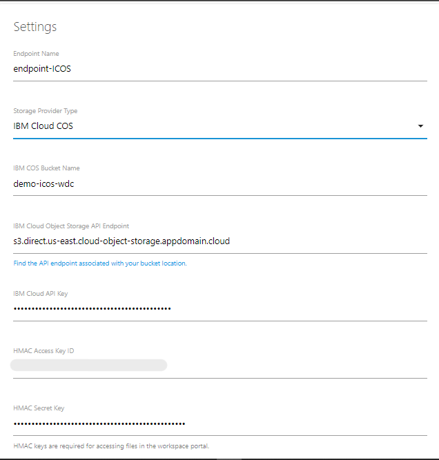
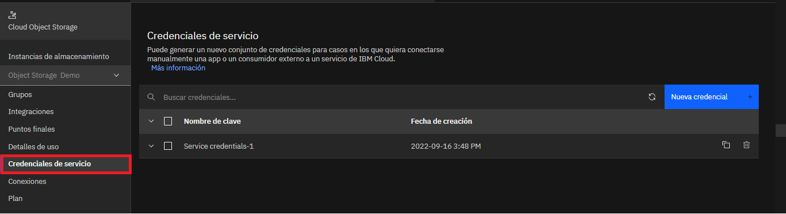
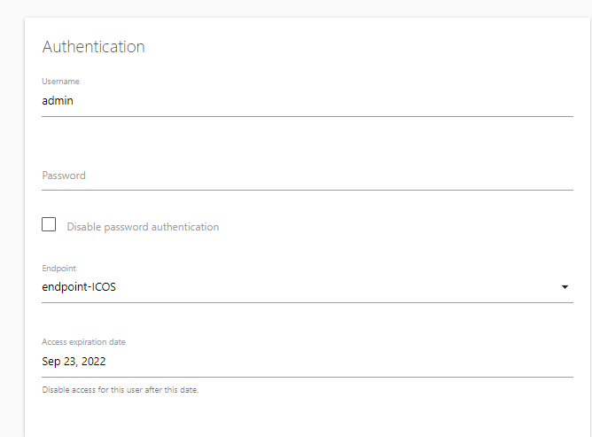

# IBM-Cloud-Object-Storage-Clients

_Instructivo de configuración para configuración de Cloud-Object-Storage en una VM como cliente_

En este repositorio se presentan 3 formas de configurar un cliente COS: Por el sistema operativo Linux Ubuntu, usando el servicio FileMage en Microsoft Windows, o con la CLI rclone independientemente del sistema operativo.

## Contenido 

1. [Aprovisionamiento de ICOS Cloud-Object-Storage](#aprovisionamiento-de-cloud-object-storage)

2. [Opción 1 - conexión por Ubuntu](#opción-1---conexión-por-ubuntu)

    1. [Configuración de máquina virtual con SO Linux Ubuntu](#configuración-de-máquina-virtual-con-so-linux-ubuntu)

3. [Opción 2 - conexión por Windows](#opción-2---conexión-por-windows)
   1. [Creación de VSI en VPC](#creación-de-vsi-en-vpc)
   2. [Configuración de disco virtual con FileMage en Microsoft Windows](#configuración-de-disco-virtual-con-filemage-en-microsoft-windows)

4. [Opción 3 - conexión por CLI RClone ](#opción-3---conexión-por-cli-rclone)

5. [Referencias](#referencias)

6. [Autores](#autores-blacknib)

## Aprovisionamiento de Cloud-Object-Storage
Para el aprovisionamiento del Cloud Object Storage y Bucket se requiere del acceso a la plataforma de IBM Cloud y al catálogo del mismo.
Una vez allí busque el servicio de **object storage** y selecciónelo, se redirigirá a una pestaña para establecer los atributos necesarios los cuales serán Nombre y Grupo de recursos.
El procedimiento se muestra a continuación:
 

Luego de ello se va a acceder al servicio y se creará un Bucket (_Cabe recalcar que el nombre del Bucket debe ser único_)
Y posterior a ello se almacenarán algunos archivos en dicho Bucket para poder tener una referencia al configurar el Cliente Remoto de IBM-Cloud-Object-Storage
El proceso se muestra a continuación:
 

Dentro del servicio se deberán configurar "Service Credentials" para generar autenticación a la hora de configurar el acceso a los buckets dentro de una máquina virtual. Estas credenciales deben ser creadas con HMAC keys, las cuales configuran el **access key** y el **secret key** del ICOS
 

A continuación se presentan dos opciones de conexión al ICOS. La primera es por medio de un sistema operativo Linux Ubuntu, y la segunda es por medio de un disco virtual en Microsoft Windows, esta segunda opción hace uso de una VSI y utiliza los servicios de Filemage.

## Opción 1 - conexión por Ubuntu

## Configuración de máquina virtual con SO Linux Ubuntu
Para una máquina con sistema operativo de Linux versión Ubuntu se requiere de la instalación del programa s3fs para la gestión de archivos, sin embargo la conexión se direccionará directamente al bucket en vez de a todo el servicio de Cloud Object Storage
Para la instalación se accederá a la terminal y se ingrsarán el siguiente comando:
```
    sudo apt-get install automake autotools-dev fuse g++ git libcurl4-openssl-dev libfuse-dev libssl-dev libxml2-dev make pkg-config
```
Luego de ello se deberá crear un archivo de texto sin extensión con las credenciales HMAC de la siguiente manera:

credentials_file
|
|----- <access_key>:<secret_key>

Y se le agregan permisos de lectura y escritura con el siguiente comando:
```
    chmod 600 <credentials_file>
```

Finalmente se debe realizar la configuración, sin embargo la ejecución del comando se debe direccionar hacia una carpeta totalmente vacía con los siguientes comandos:
```
    mkdir <New_Folder>
    s3fs <bucket_name> ./<New_Folder>  -o url=http{s}://<endpoint> –o passwd_file=<credentials_file>
```


Con ello se observa que la carpeta aparece con archivos aunque no los tenía, sin embargo para entender como funciona el Client COS se deberá subir un archivo desde la máquina en la cual se configuró y de igual manera directamente en la consola de IBM Cloud como se muestra a continuación:


## Opción 2 - conexión por Windows
A continuación se muestran los pasos a seguir para realizar la conexión del servicio ICOS desde un disco virtual en un sistema operativo Microsoft Windows

## Creación de VSI en VPC

**Creación de VPC**

Ingrese a su cuenta de IBM Cloud, en el menú desplegable del costado izquierdo seleccione la opción *VPC infrastructure* y dentro de esta el ítem *VPCs*.
Dé click en *Create*, seleccione la región y nombre para su VPC y finalmente seleccione *Create Virtual Private Cloud*.

Ingrese a la VPC que acaba de crear y baje hasta la sección *Subnets in this VPC*, seleccione una de las subnets que se encuentran allí y copie la cadena de caracteres presentada en ```subnet ID```, esta se usará más adelante en la configuración de FileMage.

**Generación de llaves SSH**

Posteriormente para generar las llaves de acceso SSH ingrese a una terminal, ya sea IBM Cloud Shell o la terminal de su computador. Ingrese el siguiente comando:

```
ssh-keygen
```
Puede ingresar la ubicación en la que desea almacenar las llaves SSH y la contraseña de las mismas, o almacenarlas en la ubicación actual presionando enter.

A continuación regrese a su cuenta de IBM Cloud, en el menú de la izquierda dé click en *SSH keys* y posteriormente en *Create*. Ingrese la siguiente información:
- **Location**: Seleccione la misma ubicación de la VPC que acaba de crear
- **Name**: Asigne un nombre a su llave SSH
- **Resource Group**: Seleccione el mismo grupo de recursos donde está su VPC.
- **Public Key**: Ingrese *todo* el contenido del archivo llamado ```id_rsa.pub```, el cuál estpa ubicado en la carpeta ```.ssh``` que creó desde la terminal en el paso anterior.


**Creación del servicio FileMage Gateway**

Ingrese al catálogo de IBM Cloud y busque el servicio *FileMage Gateway*, asígnele un nombre, grupo de recursos y ubicación y dé click en *Install*


Luego de crear su servicio de Filemage diligencie la siguiente información:
- **create_floating_ip**: true
- **vsi_instance_name**: ingrese el nombre que desea asignar a la Virtual Server Instance (VSI) que se creará.
- **vsi_security_group**: ingrese el nombre que sedea asignar al security group que se creará.
-**region**: escriba el nombre de la región en la cual creó su VPC
- **ssh_key_name**: ingrese el nombre de la llave SSH que creó en IBM Cloud en el paso anterior.
- **subnet_id**: ingrese la subnet_id que copió al momento de crear su VPC. Este ID también lo puede encontrar ingresando por el menú desplegable de la izquierda, sección *VPC Infrastructure*, opción *VPCs*, ingresando a la VPC correspondiente y posteriormente seleccionando una de las subnets.

Finalmente, dé click en *Generate plan*


Luego de que termina la creación del Filemage Schematics, dé click en *Apply plan*. Recuerde que debe tener los permisos adecuados para poder ejecutar el schematics.

Puede verificar la adecuada ejeución del Schematics ingresando en el menú desplegable de la izquierda en la sección *VPC Infrastructure*, opción *Virtual Server Instances*. Acá debería ver creada una VSI con el nombre que asignó al configurar el schematics. 


Finalmente, ingrese a la VSI recién creada y copie la dirección IP flotante que se encuentra en la sección **network interfaces**, esta será la dirección que se usará para acceder al servicio de FileMage.

## Configuración de disco virtual con FileMage en Microsoft Windows 

Para configurar el servidor de FileMage en Windows primero debera configurar el endpoint de ICOS, los usuarios y sus permisos correspondientes que tendrán sobre ICOS.

Para esto ingresamos a FileMage usando la IP del paso anterior. Luego nos logueamos en FileMage usando nuestras credenciales.


<h3>Registrar Endpoint COS</h3>

Después debemos registrar el Endpoint del servicio ICOS esto con el fin de que FileMage pueda acceder directamente a nuestro cloud object storage. Para obtener el endpoint del servicio ingresamos a este [link](https://cloud.ibm.com/docs/cloud-object-storage?topic=cloud-object-storage-endpoints) y escogemos la opción **Direct** y luego seleccionamos el endpoint que corresponda a la zona donde se encuentra nuestro Object Storage, en este caso, **us-east**.


Nos dirigimos al panel de control de FileMage y agregamos el endpoint utilizando las siguientes configuraciones



Los valores de **API Key**, **HMAC Key Access Key Id** y **HMAC Secret Key** los podrá encontrar en IBM cloud ingresando a su COS y en el apartado de **Credenciales de servicio**. El **Enpoint Name** queda a su elección.



Finalmente guarde los cambios de la configuración del endpoint.

<h3>Registrar Usuario</h3>

Luego en el panel de control de FileMage en el apartado de **Users** agregamos un usuario con los correspondientes permisos sobre ICOS.


Configure las credenciales del usuario.



Luego los permisos que desea concederle al usuario


Finalmente guarde los cambios de la configuración del usuario.

<h3>Configurar el disco virtual en windows</h3>

Ahora ya tenemos todo listo para configurar el servidor ftp como un disco virtual en Windows. Para lo anterior debemos usar la IP de la VSI donde esta FileMage y las credenciales del usuario que agregamos.

Primero vamos al explorador de archivos de windows y nos dirigimos al apartado de **Este equipo** y click derecho en un espacio vácio luego seleccionamos la opción de **Agregar una ubicación de red**.


Luego seguimos las opciones del menu primero **Siguiente** luego **Elegir ubicación de red personalizada** y finalmente cuando se solicite la **Dirección de red o internet** ingresamos la siguiente cadena 

```
ftp://ip-de-la-vsi
```


Después desmarcamos las opción de **Iniciar sesión de forma anónima** e ingresamos el usuario que creamos en el paso anterior.


Finalmente asignamos un nombre al disco virtual


Siguiendo estos pasos tendrá acceso desde un disco virtual en windows al servicio COS.


## Opción 3 - conexión por CLI Rclone

Para la instalación de RClone CLI hay dos alternativas:
- Ingrese a [https://rclone.org/downloads/](https://rclone.org/downloads/) y descrague el ejecutable correspondiente a su máquina.
- Como alternativa, en una terminal ejecutada en modo administrador, por medio de la CLI [Chocolatey](https://chocolatey.org/install) ingrese el siguiente comando:
```
choco install rclone 
```

A continuación se realiza la configuración del ICOS:

1. Ingrese el comando
```
rclone config
```
2. Escriba el nombre que asignará a su nuevo remoto, por ejemplo ```rclone-demo```


3. Seleccione el tipo de almacenamiento a configurar, en este caso ```5. IBM COS```


4. Seleccione el proveedor del servicio, en este caso ```10. IBM COS S3```


5. Seleccione la opción ```1``` para ingresar las credenciales del servicio

6. Ingrese el **access key ID** y **secret access key** de su servicio de IBM Cloud Object Storage. Estas llaves las puede encontrar en su [instancia de Cloud Object Storage](https://cloud.ibm.com/objectstorage/), seleccionando *Service Credentials* en el menú de la izquierda


7. Seleccione la opción ```1``` para ingresar la región del ICOS.


8. Seleccione el endpoint correspondiente a la región que va a utilizar en sus buckets. En este caso, para us-east se ingresa el número ```9. US Region East Endpoint```

9. Seleccione el tipo de servicio. En este caso se tiene un ICOS **Smart Tier**, por lo cual se selecciona la opción ```8. US East Region Flex```


10. Seleccione la configuración de acceso ```2```


11. Ingrese la letra ```n``` para dejar la configuración avanzada por defecto.


12. Verifique la configuración mostrada y acéptela con la tecla ```y```


13. En la documentación de RClone podrá encontrar los comandos de uso de la CLI, con los cuales podrá leer, editar y eliminar objetos en su instancia de ICOS.
Como ejemplo se presenta el comando para listar buckets:
```
rclone lsd rclone-demo:
```


14. Para facilitar el acceso a su bucket de ICOS, es posible instalar el servicio **Windows File System Proxy**, en una terminal de *PowerShell* en modo administrador con el comando
```
choco install winfsp -y
```


15. Para crear un nuevo network drive que corresponda al bucket configurado debe conocer el nombre del ```remote``` que configuró con rclone y el nombre del bucket en IBM Cloud, para esto puede usar el comando mostrado a continuación, donde ```rclone-demo``` es el nombre del remote que creó.

```
rclone lsd rclone-demo:
```

16. Ya conociendo los nombres del almacenamiento, puede crear el network drive con el comando:
```
rclone mount <nombre-del-remote>:<nombre-del-bucket-ICOS>/ S: --vfs-cache-mode full
```

Por ejemplo, en este caso sería:
```
rclone-demo:demo-icos-wdc/ S: --vfs-cache-mode full
```


17. Ya puede ingresar al network drive en su explorador de archivos y agregar, modificar o eliminar archivos. Los cambios que realice se actualizarán automáticamente en el bucket de IBM Cloud


Finalmente, a continuación se muestra la visualización de la implementación de Filemage y RClone en el explorador de archivos:


## Referencias

- [SSH Key](https://cloud.ibm.com/docs/vpc?topic=vpc-ssh-keys)
- [RClone ICOS installation](https://rclone.org/s3/#ibm-cos-s3)
- [RClone docs](https://rclone.org/docs/)
- [How to mount Amazon S3 as a drive](https://www.nakivo.com/blog/mount-amazon-s3-as-a-drive-how-to-guide/)

## Autores :black_nib:
Equipo IBM Cloud Tech Sales Colombia.
<br />